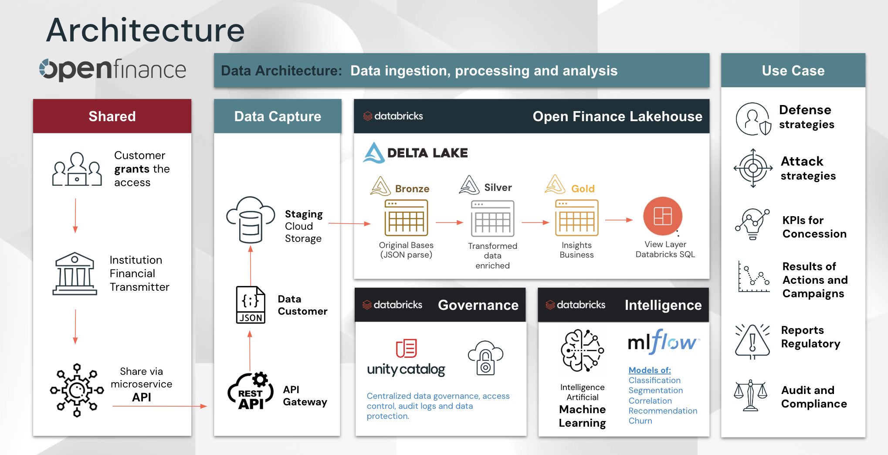

%md
# Genie Voice API Project

## Overview

The Genie Voice API project provides an APP to interact with the Genie API using text or voice, allowing users to start conversations, send messages, and retrieve query results. In addition, it also allows you to perform contextualized questions to a RAG (Retrieval-augmented generation). This project is designed to work within a Databricks environment and leverages the Databricks SDK for additional functionalities.

Follow some features:
 - **Databricks APPs**:
Databricks Apps are applications that run within the Databricks environment, leveraging its capabilities for data processing, analytics, and machine learning. These apps can be used to build, deploy, and manage data-driven solutions, integrating seamlessly with Databricks' suite of tools and services. They provide a way to extend the functionality of Databricks
 - **Genie Spaces and Genie Spaces API**:
 Genie Spaces are a feature within the Databricks platform that allow users to create domain-specific environments for interacting with data using natural language queries. These spaces are designed to help business users and data analysts easily access and analyze data without needing deep technical knowledge. Genie Spaces leverage AI to understand and process queries, providing relevant insights and results.
 - **Generative AI**: 
   - **Mosaic AI Vector Search**:
  Mosaic AI Vector Search is a vector database solution integrated into the Databricks Data Intelligence Platform. It is designed to store and retrieve embeddings, which are mathematical representations of the semantic content of data, such as text or images. These embeddings are generated by large language models and are crucial for many Generative AI (GenAI) applications, including Retrieval-Augmented Generation (RAG) systems, recommender systems, and image and video recognition.
   - **Mosaic AI Foundation Model Serving**:
  Mosaic AI Foundation Model Serving is a feature within the Databricks platform that provides a unified interface to deploy, govern, and query AI models. It supports serving custom models, state-of-the-art open models, and external models, making it a versatile solution for various AI applications.
   - **Mosaic AI Agent Evaluation**:
  Mosaic AI Agent Evaluation is a feature within the Databricks platform designed to help developers evaluate the quality, cost, and latency of agentic AI applications, including Retrieval-Augmented Generation (RAG) applications and chains. 

## Architecture

## Setup

### Prerequisites

1. **Databricks Workspace**: Ensure you have access to a Databricks workspace.
2. **API Token**: Obtain a Databricks API token for authentication.
3. **Python Libraries**: Install the required Python libraries.

### Installation

1. **Clone the Repository**:
    sh git clone <_url> cd <_directory>

2. **SET Required Libraries**:
    Go to the file `/config` and set the variables with the required info

3. **Execute the `setup` notebook**:
    After setting the required variable at `config` file, open the `setup` and click at `Run All`

4. **Create the Genie Space**:
    Using those generated tables at setup, go to the Genie menu and create a Genie Space selecting and select those 6 tables. Don't forget to set Genie Space Instructions 

5. **Test the App**:
    Generate a new token and test the app

## Developer Environment Setup (macOS/*nix)
- Clone repo to local machine and cd into repo directory
- Install [ASDF](https://asdf-vm.com/guide/getting-started.html) and plugins for Node.js and Python
- Run `$ asdf install` to install runtimes from scratch
- Change directory to application folder you wish to develop on

> You may need to spawn additional terminal sessions to develop both backend and frontend concurrently.

### Backend (APP)
Create virtual environment, install dependencies, and run FastAPI server in development mode.
1. `$ cd app`
2. `$ python -m venv venv`
3. `$ source venv/bin/activate`
4. `$ pip install -r requirements.txt`
5. `$ fastapi dev app.py`

### Frontend
Install dependencies and run React server in development mode.
1. `$ cd frontend`
2. `$ npm install`
3. `$ npm start`

---
---
---

## 🚀 Databricks CLI and App Deployment Guide

  

This guide walks you through installing the Databricks CLI, configuring your environment, and deploying your application using Databricks. Follow the steps carefully for a smooth deployment process.

  

**1. 🛠️ Install the Databricks CLI**

  

First, install the latest version of the Databricks CLI. You can find detailed instructions in the [Databricks CLI Installation Guide](https://docs.databricks.com/en/dev-tools/cli/install.html).

  

**2. 🔗 Connect to the Databricks Environment**

  

Once the CLI is installed, connect to the e2-demo-west environment using the following command:

    databricks configure --profile e2-demo-west

If you already have a .databrickscfg file on your laptop, update the default profile to point to e2-demo-west. Alternatively, use the correct configuration profile to connect to this environment.

**3. 📝 Create Your App in Databricks**

  

Create your application within Databricks by running the following command:

    databricks apps create "YOUR_APP_NAME" --description "YOUR_DESCRIPTION"

After running this command, you should receive a success response with details such as the creation time, creator’s email, and the app URL. Save this URL for later use in the deployment process.

**Example Success Response:**

    {
          "create_time": "2024-08-05T14:55:31Z",
          "creator": "cal.reynolds@databricks.com",
          "description": "Industry GenAI Demo App. Not to be deleted",
          "name": "fins-cap-markets-app",
          "service_principal_id": 2793684989571614,
          "service_principal_name": "app(m2m) fins-cap-markets-app",
          "status": {
            "message": "App is created successfully, ready to deploy.",
            "state": "IDLE"
          },
          "update_time": "2024-08-05T14:55:32Z",
          "updater": "cal.reynolds@databricks.com",
          "url": "https://fins-cap-markets-app-2556758628403379.aws.databricksapps.com"
        }

**4. 📦 Packaging Your Frontend App**

  

To prepare your frontend application for deployment, navigate to your frontend directory and run the build command:

    npm run build

This will generate a set of static assets that are ready to be deployed into a /build folder.

  

**5. 🧹 Cleaning Up Your Backend App**

  

**Backend (Python with FastAPI)**

  

If your backend is a Python application built with FastAPI, make the following adjustments:

  

•  **Mount Static Files**: Add a mount function to your FastAPI application to serve the static files generated in the build directory:

    from fastapi import FastAPI
    from fastapi.staticfiles import StaticFiles
    
    app = FastAPI()
    target_dir = "build"
    app.mount("/", StaticFiles(directory=target_dir, html=True), name="site")

•  **Remove Unnecessary Components**: In your app.py file, remove any “run” commands and middleware, such as CORS, that are not needed for the deployed environment.

  

**Frontend Configuration**

  

If you are using Vite for your frontend, your app should have a .env file containing the backend URL. Initially, this URL might point to your local backend (e.g., `VITE_API_URL=http://127.0.0.1:8000`). Update this to point to the URL provided by the databricks apps create command:

    REACT_APP_API_URL=https://fins-cap-markets-app-2556758628403379.aws.databricksapps.com

**6. 📤 Pushing the Code to Databricks**

  

Now that your app is packaged and configured, it’s time to push the code to Databricks.

  

1. **Navigate to Your Industry Folder**: Use the relevant industry folder in your master directory on Databricks. Example path: https://e2-demo-west.cloud.databricks.com/browse/folders/3818321985853168?o=2556758628403379.

2. **Upload Your App Assets**:

•  Run npm run build in your local frontend directory to create the build folder with all static assets.

•  Compress the build folder into a .zip file.

•  Manually upload the compressed build.zip file into your Databricks industry folder. The package will uncompress automatically, creating a build folder in your relevant industry folder.

3. **Import Backend Files**: Upload your app.py, requirements.txt, and any supporting scripts or folders into the same folder in Databricks.

4. **Create an** **app.yaml** **File**: In the same folder as your app.py, create an app.yaml file containing the backend run commands. For FastAPI, it might look like this:
---
    command: ["uvicorn", "app:app"]

---
Replace the parameters with the appropriate command for your app.

  

5. **Deploy Your App**: Deploy your app using the following command:
---
    databricks apps deploy "path-to-app.py-folder-on-databricks" "YOUR_APP_NAME" dev
---

6. **Check the Deployment Response**: If the deployment is successful, you’ll receive a response indicating that the app process is running. If not, you will see an error message. In case of errors, debug the deployment by visiting YOUR_APP_URL/logz for a log stream.

Reach out to @Cal Reynolds w/ questions and/or @Andre Furlan Bueno if things get especially tricky. 

## Contributing

Contributions are welcome! Please open an issue or submit a pull request for any changes.
